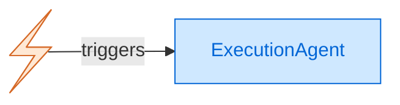
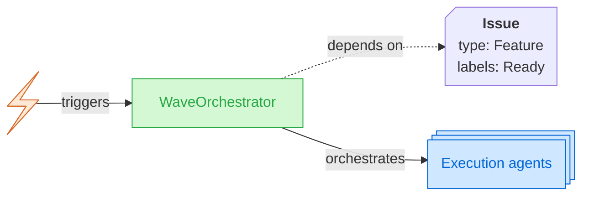
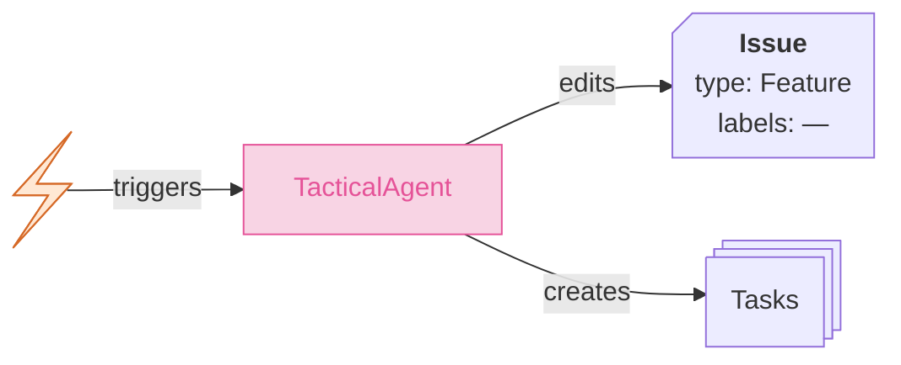
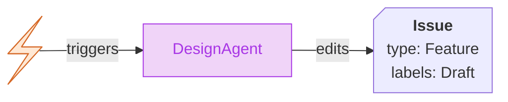
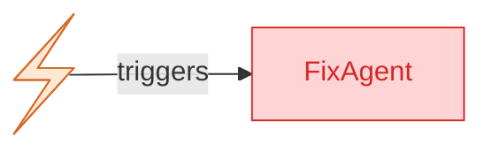
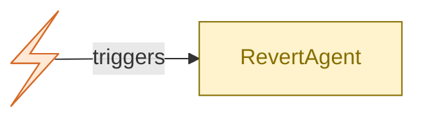
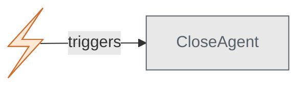

## Agent layers

### Execution agent

#### Triggers
- **Issue comment**: slash command `/agents execute` + issue is not a PR + issue is not labeled `Feature`
- **Workflow dispatch**: `issue_number` + `base_branch` (used by wave orchestrator to dispatch tasks)

#### Behaviors

<strong>Scenario A: Orphan task (no feature parent) — PR to <code>main</code>, no auto-merge</strong>

<!--
agents/execution/pre.sh + post.sh

Env vars (from runtime):
- ISSUE_NUM
- BASE_BRANCH (defaults to AUTODUCKS_BASE_BRANCH, i.e. "main")
- REPO
- COMMENT_ID
- RUN_ID
- GH_TOKEN

Permissions:
- contents: write
- issues: write
- pull-requests: write
- actions: write
- id-token: write
-->

<!-- PRE EXECUTION -->
1. React to the trigger comment with 👀. <!-- react_to_comment(COMMENT_ID, "eyes") -->
2. BASE_BRANCH defaults to the configured base branch (e.g. `main`). No feature number is extracted. <!-- BASE_BRANCH = AUTODUCKS_BASE_BRANCH -->
3. A slug is generated from the issue number and title. <!-- git::generate_slug(ISSUE_NUM, title) -->
4. A task branch is created locally from `main` following the pattern `feature/0-issue-{issue_num}-{timestamp}`. <!-- git checkout -b TASK_BRANCH -->
5. The issue spec (title + body) is written to `/tmp/task-spec.md` for the LLM. <!-- its::get_issue(ISSUE_NUM) -->
<!-- EXECUTION -->
6. The LLM agent reads `/tmp/task-spec.md` and implements the task. Only code changes — no git, no API calls.
<!-- POST EXECUTION -->
7. `assert_changes` validates the agent produced changes. On failure: notifies and exits with 😕 reaction. <!-- assert_changes() -->
8. Changes are committed and pushed. <!-- git::push_branch(TASK_BRANCH) -->
9. A PR is created targeting `main` with title `Task #N: {title}` and body `fixes #N`. <!-- git::create_pr(TASK_BRANCH, BASE_BRANCH, title, body) -->
10. **No auto-merge** — PR requires human review.
11. React to the trigger comment with 👍. Comment on the issue confirming PR creation. <!-- react_to_comment(COMMENT_ID, "+1") + its::comment_issue() -->

<strong>Scenario B: Task with feature parent — PR to <code>feature/*</code> branch (auto-merge)</strong>

<!--
agents/execution/pre.sh + post.sh

Env vars (from runtime, set by wave orchestrator dispatch):
- ISSUE_NUM
- BASE_BRANCH (e.g. "feature/42-user-auth")
- REPO
- COMMENT_ID
- RUN_ID
- GH_TOKEN

Permissions: same as Scenario A
-->

<!-- PRE EXECUTION -->
1. React to the trigger comment with 👀. <!-- react_to_comment(COMMENT_ID, "eyes") -->
2. The feature number is extracted from BASE_BRANCH via regex `feature/([0-9]+)`. <!-- FEATURE_NUM = BASH_REMATCH[1] -->
3. Wait for the feature branch to be visible (replication lag). <!-- wait_for_branch(BASE_BRANCH) -->
4. A slug is generated and a task branch is created locally from the feature branch, following the pattern `feature/{feature_num}-issue-{issue_num}-{timestamp}`. <!-- git checkout -b TASK_BRANCH -->
5. The issue spec is written to `/tmp/task-spec.md` for the LLM. <!-- its::get_issue(ISSUE_NUM) -->
<!-- EXECUTION -->
6. The LLM agent reads `/tmp/task-spec.md` and implements the task. Only code changes — no git, no API calls.
<!-- POST EXECUTION -->
7. `assert_changes` validates the agent produced changes. On failure: notifies on both the task and parent feature issue, reacts with 😕. <!-- assert_changes() + notify_failure() -->
8. Changes are committed and pushed. <!-- git::push_branch(TASK_BRANCH) -->
9. A PR is created targeting the feature branch with title `Task #N: {title}` and body `fixes #N`. <!-- git::create_pr(TASK_BRANCH, BASE_BRANCH, title, body) -->
10. **Auto-merge with rebase retry** (up to 3 attempts). On merge conflict: rebases onto the feature branch and force-pushes with lease. On persistent failure: notifies and exits. <!-- git::merge_pr(PR_NUM) + rebase loop -->
11. Triggers the wave orchestrator to continue processing next wave (non-fatal — PR merge event is the primary trigger). <!-- trigger_loop_closure(FEATURE_NUM) -->
12. React to the trigger comment with 👍. Comment on the issue confirming PR creation. <!-- react_to_comment(COMMENT_ID, "+1") + its::comment_issue() -->

---

### Wave orchestrator

#### Triggers
- **Issue comment**: slash command `/agents execute` + issue labeled `Feature` + label `Ready`
- **PR merge**: PR merged into a branch starting with `feature/` (loop closure)
- **Workflow dispatch**: `feature_issue` number (manual trigger or loop closure callback)

#### Behavior

<!--
agents/waveOrchestrator/run.sh

Env vars (from runtime):
- FEATURE_ISSUE
- REPO
- COMMENT_ID
- RUN_ID
- WORKER_MODEL (optional, passed to execution agents)
- WORKER_REASONING (optional, passed to execution agents)
- GH_TOKEN

Permissions:
- contents: write
- issues: write
- pull-requests: write
- actions: write

100% deterministic — no LLM invocation.
-->

1. React to the trigger comment with 👀. <!-- react_to_comment(COMMENT_ID, "eyes") -->
2. Fetch the feature issue body and parse waves from it (supports YAML `waves:` blocks and Markdown wave headers with task lists). <!-- its::get_issue(FEATURE) + parse_waves(ISSUE_BODY) -->
3. Ensure the feature branch `feature/{id}-{slug}` exists. If not, create it from the configured base branch and wait for visibility. Remove `draft` label once branch is created. <!-- git::generate_slug() + git::create_branch() + its::remove_label("draft") -->
4. Detect completed tasks by scanning merged PRs targeting the feature branch for `fixes/closes/resolves #N` references. <!-- git::list_merged_prs(FEATURE_BRANCH) -->
5. Update task checkboxes `[x]`/`[ ]` on the feature issue body based on completed tasks. <!-- update_checkboxes(FEATURE, DONE_TASKS) -->
6. Compute wave states: a wave is `done` when all its tasks have merged PRs; otherwise `pending`. <!-- loop over WAVE_TASKS -->
7. Find the next ready wave: the first `pending` wave whose preceding waves are all `done`. <!-- sequential dependency check -->
8. **If a next wave is found**: dispatch execution agents in parallel for each undone task, skipping already-done or already-dispatched tasks (duplicate dispatch prevention). Post a summary comment listing dispatched and skipped tasks. <!-- prevent_duplicate_dispatch() + git::dispatch_workflow("autoducks-execute.yml", ...) + its::comment_issue() -->
9. **If all waves are done**: create the final feature PR (if it doesn't exist) with `Closes #task` for every task and `Closes #feature`. Comment that the feature is ready for review. <!-- create_final_pr() + its::comment_issue() -->
10. **If blocked** (not all previous waves done): comment that orchestration is waiting for dependencies.
11. React to the trigger comment with 👍. <!-- react_to_comment(COMMENT_ID, "+1") -->

---

### Tactical agent

#### Triggers

- **Issue comment**: slash command `/agents devise`
- **Issue comment**: slash command `/agents execute` + issue labeled `Feature` + issue not labeled `Ready` (auto-escalation: redirects to tactical planning first)

#### Behavior

<!--
agents/tactical/pre.sh + post.sh

Env vars (from runtime):
- ISSUE_NUM
- REPO
- COMMENT_ID
- RUN_ID
- COMMENTER
- GH_TOKEN

Permissions:
- contents: read
- issues: write
- pull-requests: write
- id-token: write
-->

<!-- PRE EXECUTION -->
1. React to the trigger comment with 👀. <!-- react_to_comment(COMMENT_ID, "eyes") -->
2. Fetch the issue content (title + body) and write it to `/tmp/issue-request.md` for the LLM. <!-- its::get_issue(ISSUE_NUM) -->
3. **Revision detection**: if the issue already has the `Ready` label, this is a plan revision. Extract existing task numbers from the YAML block in the issue body, and build revision context from prior plan + comments. <!-- build_revision_context(ISSUE_NUM, OLD_NUMBERS) -->
<!-- EXECUTION -->
4. The LLM agent reads the issue spec (and revision context, if applicable) and produces either:
   - A plan written to `/tmp/plan-body.md` (with `## Tasks` section containing `### T1 — Title` entries), or
   - Questions written to `/tmp/questions.md` if critical information is missing.
<!-- POST EXECUTION -->
5. **Questions mode**: if the agent wrote questions, post them as a comment and exit. <!-- ask_questions(ISSUE_NUM, /tmp/questions.md) -->
6. **Parse the plan**: the deterministic parser (`parse-plan.py`) extracts tasks from the `## Tasks` section, validates structure (Summary, Tasks, AcceptanceCriteria required per task), and produces `/tmp/tasks.jsonl`. On parse failure: posts error as comment and exits. <!-- parse-plan.py -->
7. **Reconcile tasks**: create new task issues, update existing ones if changed, close dropped tasks. Map `T1/T2/...` placeholders to real issue numbers. <!-- reconcile_tasks(ISSUE_NUM, /tmp/tasks.jsonl, OLD_NUMBERS) -->
8. Replace `T1/T2/...` placeholders in the plan body with real issue numbers. Strip the `## Tasks` section (tasks are now separate issues). Update the feature issue body. <!-- its::update_issue_body(ISSUE_NUM, /tmp/feature-body.md) -->
9. **First pass only** (not revision): add `Ready` label, set issue type to `Feature`, create feature branch `feature/{id}-{slug}` from base branch, create PR targeting base branch with `Closes #N`, and assign the commenter. <!-- its::add_label("Ready") + its::set_issue_type("Feature") + git::create_branch() + git::create_pr() -->
10. React to the trigger comment with 👍. Comment with the list of created tasks and a suggestion to run `/agents execute`. <!-- react_to_comment(COMMENT_ID, "+1") + its::comment_issue() -->

---

### Design agent

#### Triggers
- **Issue comment**: slash command `/agents design`
- **Issue assignment**: issue has the `Draft` label

#### Behavior

<!--
agents/design/pre.sh + post.sh

Env vars (from runtime):
- ISSUE_NUM
- REPO
- COMMENT_ID
- RUN_ID
- COMMENTER
- GH_TOKEN

Permissions:
- contents: read
- issues: write
- pull-requests: write
- id-token: write
-->

<!-- PRE EXECUTION -->
1. React to the trigger comment with 👀. <!-- react_to_comment(COMMENT_ID, "eyes") -->
2. Fetch the issue content (title + body) and write it to `/tmp/issue-request.md` for the LLM. <!-- its::get_issue(ISSUE_NUM) -->
<!-- EXECUTION -->
3. The LLM agent reads the issue and produces a full design specification written to `/tmp/design-spec.md`. The agent explores the codebase (read-only) to ground the spec in reality.
<!-- POST EXECUTION -->
4. Validate the design spec was produced. On failure: notifies and exits with 😕 reaction. <!-- notify_failure() -->
5. Update the issue body with the design specification. <!-- its::update_issue_body(ISSUE_NUM, /tmp/design-spec.md) -->
6. Set issue type to `Feature`. <!-- its::set_issue_type(ISSUE_NUM, "Feature") -->
7. Remove the `Draft` label. <!-- its::remove_label(ISSUE_NUM, "Draft") -->
8. React to the trigger comment with 👍. Comment suggesting the user run `/agents devise` to create the tactical plan. <!-- react_to_comment(COMMENT_ID, "+1") + its::comment_issue() -->

---

## Utility agents

### Fix agent

#### Triggers
- **Issue comment**: slash command `/agents fix`

#### Behavior

<!--
agents/fix/pre.sh + post.sh

Env vars (from runtime):
- ISSUE_NUM
- REPO
- COMMENT_ID
- RUN_ID
- GH_TOKEN

Permissions:
- contents: write
- issues: write
- pull-requests: write
- id-token: write
-->

<!-- PRE EXECUTION -->
1. React to the trigger comment with 👀. <!-- react_to_comment(COMMENT_ID, "eyes") -->
2. Extract feature number from BASE_BRANCH if it's a feature branch. <!-- FEATURE_NUM from regex -->
3. Search for an existing partial branch from a prior failed attempt via `git::find_branches_matching("feature/{feature_num}-issue-{issue_num}-")`. If found, checkout that branch to continue from where the previous attempt left off. Otherwise, create a new fix branch `feature/{feature_num}-issue-{issue_num}-fix-{timestamp}`. <!-- git::find_branches_matching() -->
4. Prepare the task spec from the issue body. Prepare failure context from recent comments (last 10). <!-- its::get_issue() + its::list_comments(ISSUE_NUM, 10) -->
<!-- EXECUTION -->
5. The LLM agent reads both the task spec and failure context, then fixes or completes the implementation.
<!-- POST EXECUTION -->
6. Commit and push changes (tolerates existing commits on reused branches). <!-- git::push_branch(TASK_BRANCH) -->
7. Check for an existing PR on the branch. If none, create a new PR titled `Fix: {title}` with `fixes #N`. If one exists, reuse it. <!-- git::create_pr() or reuse EXISTING_PR -->
8. **If feature-parented**: auto-merge the PR. On failure: notifies and exits. On success: triggers wave orchestrator for loop closure. <!-- git::merge_pr() + trigger_loop_closure() -->
9. React to the trigger comment with 👍. Comment confirming the fix. <!-- react_to_comment(COMMENT_ID, "+1") + its::comment_issue() -->

---

### Revert agent

#### Triggers
- **Issue comment**: slash command `/agents revert`

#### Behavior

<!--
agents/revert/run.sh

Env vars (from runtime):
- FEATURE_ISSUE
- REPO
- COMMENT_ID
- RUN_ID
- COMMENTER
- GH_TOKEN

Permissions:
- contents: write
- issues: write

100% deterministic — no LLM invocation.
-->

1. React to the trigger comment with 👀. <!-- react_to_comment(COMMENT_ID, "eyes") -->
2. Fetch the feature issue body and extract task numbers from the YAML `waves:` block. <!-- its::get_issue(FEATURE) + yq parse -->
3. Close all task issues with a comment referencing the revert. <!-- its::close_issue(task, "Reverted by /agents revert on #FEATURE") -->
4. Remove `Ready` and `draft` labels from the feature issue. <!-- its::remove_label() -->
5. Restore the original issue body by finding the last non-bot edit from the edit history (via GraphQL `userContentEdits`). <!-- its::get_issue_edit_history(FEATURE) -->
6. Delete all bot comments (from `github-actions[bot]`) on the feature issue. <!-- its::list_comments() + its::delete_comment() -->
7. React to the trigger comment with 👍. <!-- react_to_comment(COMMENT_ID, "+1") -->

---

### Close agent

#### Triggers
- **Issue comment**: slash command `/agents close`

#### Behavior

<!--
agents/close/run.sh

Env vars (from runtime):
- FEATURE_ISSUE
- REPO
- COMMENT_ID
- RUN_ID
- COMMENTER
- GH_TOKEN

Permissions:
- contents: write
- issues: write
- pull-requests: write

100% deterministic — no LLM invocation.
-->

1. React to the trigger comment with 👀. <!-- react_to_comment(COMMENT_ID, "eyes") -->
2. Fetch the feature issue body and extract task numbers from the YAML `waves:` block. <!-- its::get_issue(FEATURE) + yq parse -->
3. For each task:
   a. Find matching branches via `git::find_branches_matching("feature/{feature_num}-issue-{task_num}-")`.
   b. Close any open PRs on those branches with a comment. <!-- git::close_pr() -->
   c. Delete the task branches. <!-- git::delete_branch() -->
   d. Close the task issue with a comment. <!-- its::close_issue() -->
4. Find the feature branch `feature/{id}-{slug}` and, if it exists:
   a. Close the feature PR (if open). <!-- git::close_pr() -->
   b. Delete the feature branch. <!-- git::delete_branch() -->
5. Close the feature issue with a cleanup summary (tasks closed, PRs closed, branches deleted). <!-- its::close_issue(FEATURE, summary) -->
6. React to the trigger comment with 👍. <!-- react_to_comment(COMMENT_ID, "+1") -->
