# autoducks

> An opinionated GitHub Actions package built on top of [Anthropic's official Claude Code + GitHub Actions integration](https://code.claude.com/docs/en/github-actions).

The official integration hands you a Claude Code run triggered by `@claude` on an issue or PR — one agent, one task, ship. This repo extends that baseline into an **SDD-style loop** (Spec-Driven Development): the feature issue body *is* the plan (YAML waves + task references), each task issue *is* its own unit spec (summary, checkboxes, acceptance criteria), and a deterministic orchestrator ships the whole graph in dependency order without leaving GitHub.

Every piece works in isolation — use the full `/agents plan` → `/agents start` → ship chain, or pick a single verb for a one-off.

---

## TL;DR

- **6 slash commands** on issue comments: `/agents plan`, `/agents start`, `/agents work`, `/agents fix`, `/agents revert`, `/agents close`.
- **Every command is usable in isolation.** You don't have to run a full plan → start → ship pipeline — each verb does one thing well.
- **Only 3 of the 6 workflows actually call Claude** (plan, task, fix). The other three are pure shell. Cheaper + faster + no LLM drift.
- **Feature issues are first-class GitHub objects**: they get the native `Feature` issue type, task issues get `Task`, and task-feature relationships use the sub-issues API.
- **Reactions on the trigger comment** tell you at a glance whether the workflow succeeded: 👀 while running, 👍 on success, 😕 on failure.

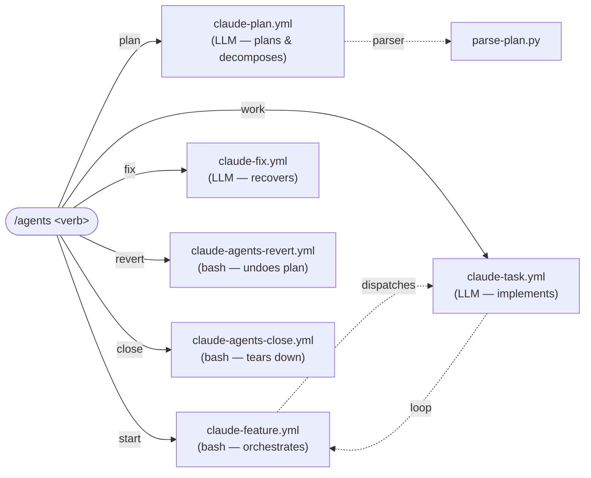

---

## Why this exists

Copilot Coding Agent and similar SaaS products charge per-seat to run agents against your repos. If you already pay for Claude Max (or Codex, or any other harness), you shouldn't have to pay again just to wire them into GitHub.

This project is a **bridge**, not an agent:

- **BYO harness, BYO subscription.** Plug in your `CLAUDE_CODE_OAUTH_TOKEN` (and whatever credentials a future harness needs). No per-seat licensing, no vendor bot in the middle.
- **Harness-agnostic by design.** Claude today; the workflow contracts are generic enough that Codex and other harnesses drop in without rewriting the core.
- **GitHub-native surface.** Triggers are the things GitHub already gives you — comments, mentions, assignments, labels, PR merges. No external dashboard, no webhook server, no sidecar service to host.
- **Deterministic shell, LLM where it counts.** Orchestration, reconcile, revert, and close are 100% bash/Python. LLM calls happen only in `plan`, `work`, and `fix` — three of six workflows.
- **Composable verbs.** Every `/agents <verb>` works in isolation. SDD-style `plan → waves → ship` is one useful combination, not a required ceremony.

---

## Install

```bash
curl -fsSL https://raw.githubusercontent.com/deepducks/autoducks/main/scripts/install.sh | bash
```

Only `.github/` is modified. On a fresh install, setup runs automatically. Run again at any time to update to the latest version.

Then one-time prereqs per repo/org (the setup script checks all of these):

| Prereq | How |
|---|---|
| `CLAUDE_CODE_OAUTH_TOKEN` secret | `gh secret set CLAUDE_CODE_OAUTH_TOKEN` — get it from [claude.com/oauth/code](https://claude.com/oauth/code). Org-level is fine (`--org <name> --visibility all`). |
| Claude Code GitHub App | Install at [github.com/apps/claude](https://github.com/apps/claude) and grant it the target repos. |
| Actions write + PR creation | `gh api repos/OWNER/REPO/actions/permissions/workflow -X PUT -f default_workflow_permissions=write -F can_approve_pull_request_reviews=true` |
| Issue types `Feature` and `Task` (optional) | Create at `github.com/organizations/<ORG>/settings/issue-types`. Without them, workflows still run — the native type is just silently skipped; the `feature` label still distinguishes feature issues from task issues. |

Validate with the end-to-end smoke test (creates a throwaway plan, ships it, tears it down):

```bash
./scripts/smoke-test.sh --cleanup              # orchestrator → workers → final PR → /agents close
./scripts/smoke-test-plan.sh                   # /agents plan → types + sub-issues → /agents revert
```

---

## Commands cheatsheet

Every trigger is an issue comment that starts with `/agents <verb>`. Verbs that call Claude accept optional `[model] [reasoning]` args. Workflows are gated by labels — the right issue context determines which verb is valid.

| Verb | Trigger context | Does | Accepts args |
|---|---|---|---|
| `/agents plan [model] [reasoning]` | Any issue that isn't a task (no `priority:P*`) | Converses, asks clarifying questions or drafts a plan. Revises on re-invocation. | ✅ |
| `/agents start [model] [reasoning]` | Issue with `feature` label | Kickstarts the orchestrator loop. Removes `draft` label; args propagate to downstream task workers. | ✅ |
| `/agents work [model] [reasoning]` | Any issue WITHOUT `feature` label | Runs a task worker on that specific issue. Useful standalone (no plan, no orchestrator). | ✅ |
| `/agents fix [model] [reasoning]` | Any issue WITHOUT `feature` label, typically after a failed task worker | Picks up the existing partial branch, reads failure context, retries. | ✅ |
| `/agents revert` | Issue with `feature` label | Closes tasks, strips labels, deletes comments, reverts body to pre-plan state. | ❌ |
| `/agents close` | Issue with `feature` label | Closes tasks, deletes task branches, closes PRs, deletes the feature branch, closes the feature issue. | ❌ |

Directive args (for the 4 LLM verbs):
- **model:** `opus` | `sonnet` | `haiku` (default: `opus` for plan, `sonnet` for work/fix)
- **reasoning:** `off` | `low` | `medium` | `high` | `max` (default: `high`)

Examples: `/agents plan sonnet low`, `/agents fix opus max`, `/agents work haiku off`.

---

## Use cases

### 1. Full autonomy: plan → start → ship

You write a feature request and let Claude plan, decompose, and ship it — no human intervention after the kickstart.

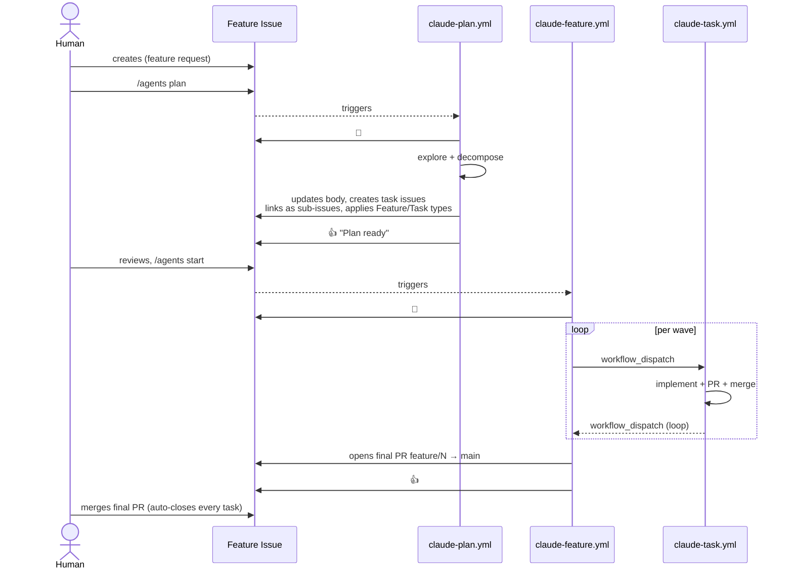

### 2. Architect locally with Claude Code, execute remotely

Use `claude` in plan mode on your laptop to discuss architecture in depth, have Claude draft and file the GitHub issue, then kick off the autonomous flow with `/agents plan` to get task decomposition and tracking.

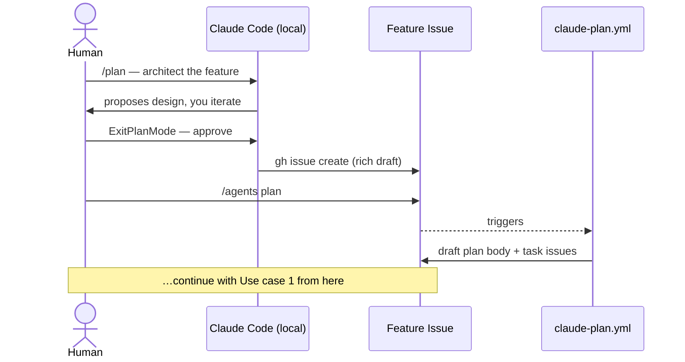

Why this split works well: Claude Code local has your full context (open files, running dev server, git state, conversation memory). The GitHub plan-agent doesn't — it can only explore the checked-out repo. So you use local Claude to decide **what** to build and **why**, then hand a well-scoped draft to the GitHub agent to decide **how to decompose** and who-does-what.

### 3. Manual plan + autonomous execution

You already know exactly what needs to happen — write the feature issue and task issues yourself, skip `/agents plan`, jump straight to `/agents start`.

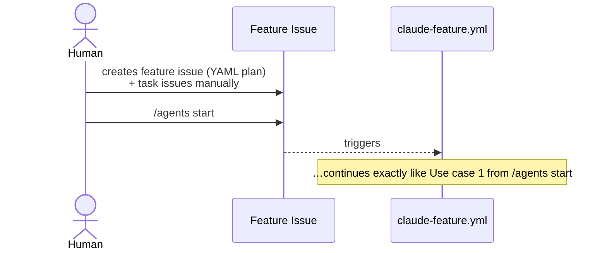

The feature issue's body just needs a YAML `waves:` block with task numbers — no plan-agent needed. See [Feature issue format](#feature-issue-format).

### 4. One-off task (no plan, no orchestrator)

You have a single task issue and want Claude to implement it — no waves, no feature branch, no plan.

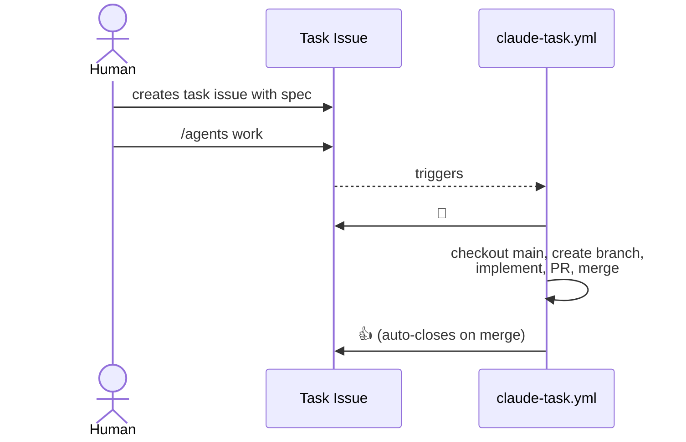

The task worker is happy to run on any non-feature issue. No label gating beyond "isn't a feature issue."

### 5. Recover a failed task

A task worker crashed, merge-conflicted, or ran out of time. Retry with extra context:

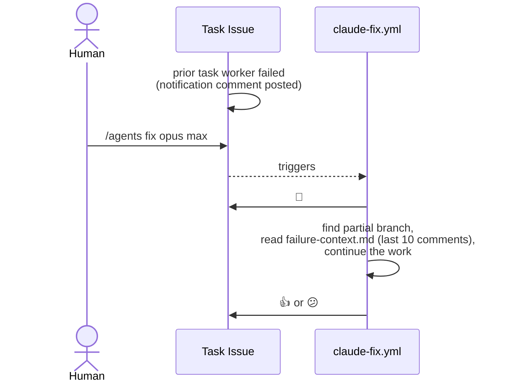

You can escalate reasoning (`opus max`) specifically on fix to throw more compute at a tricky failure without affecting the default for fresh task workers.

### 6. Revert a bad plan

The plan turned out wrong (bad scope, wrong decomposition) but no implementation has started yet. Put the feature issue back to its pre-plan state:

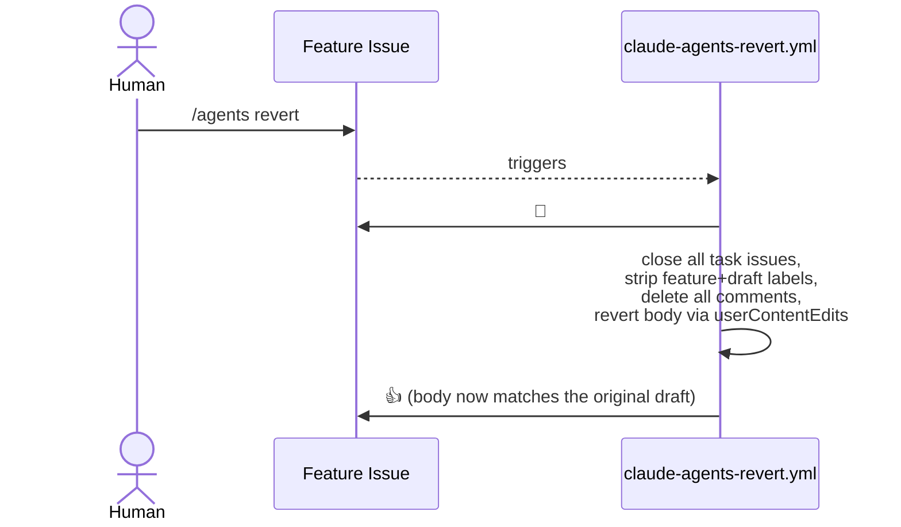

`/agents revert` intentionally does NOT touch branches or PRs — if any implementation has started, use `/agents close` instead.

### 7. Close a shipped (or abandoned) epic

Tear down every artifact of a feature: task issues, task branches, open PRs, the feature branch, and the feature issue itself.

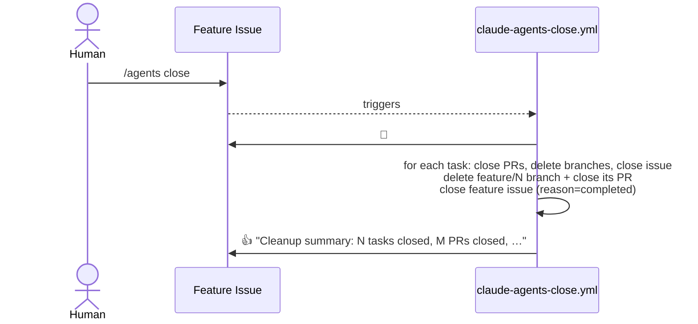

Use this after a successful ship (main has the merged work — close cleans up orchestration scaffolding without undoing code), or as a "abandon this epic" command.

---

## Architecture

### Feature issue lifecycle

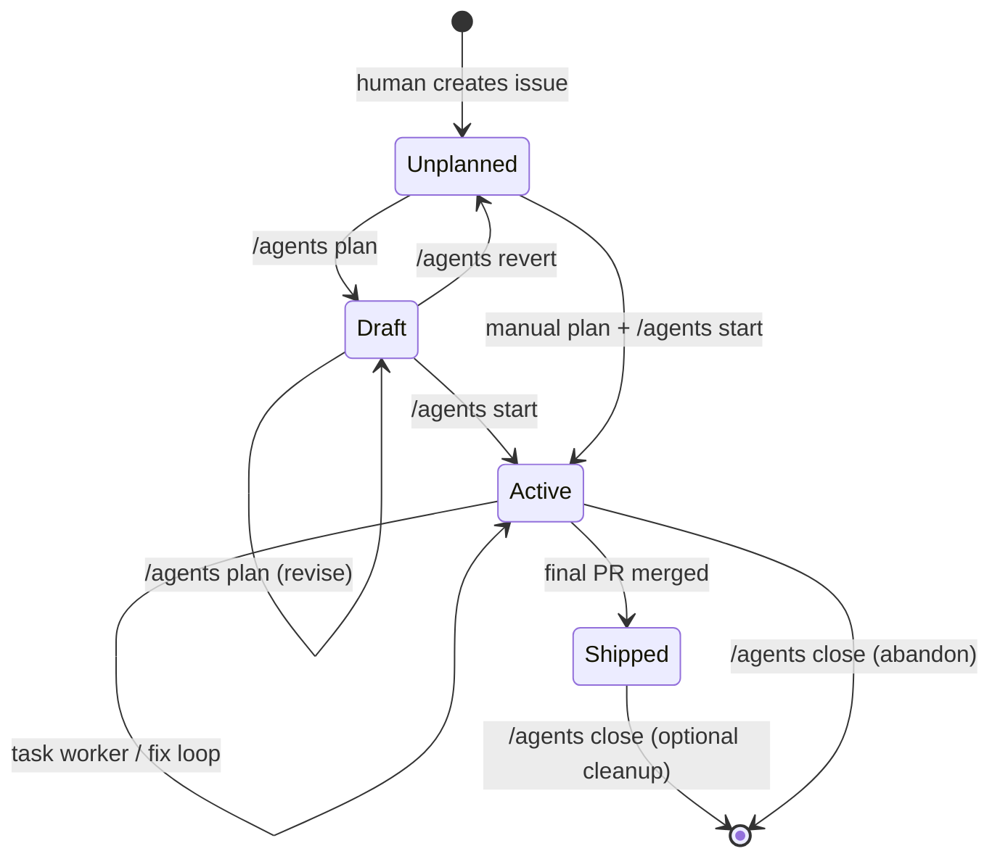

**Labels drive the state**: `feature` + `draft` = Draft, `feature` without `draft` = Active, no labels = Unplanned. Trigger guards in the workflows are label-based.

### Branch model

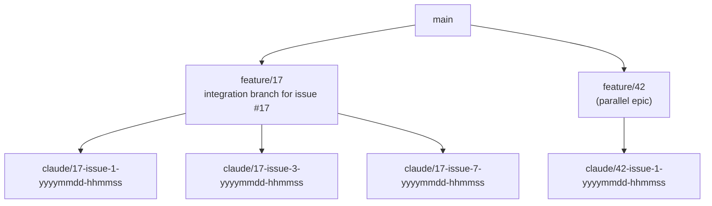

- Each feature issue gets its own integration branch: `feature/<issue_number>`.
- Each task branches from the feature branch: `claude/<feature>-issue-<task>-<timestamp>`.
- Task PRs target the feature branch (not `main`).
- When all tasks merge, the orchestrator opens a final PR `feature/<N>` → `main` with `Closes #N` for every task plus the feature issue (GitHub auto-closes them when this PR merges into `main`).
- Multiple feature issues run in parallel with zero collision.

### Plan agent, step-by-step

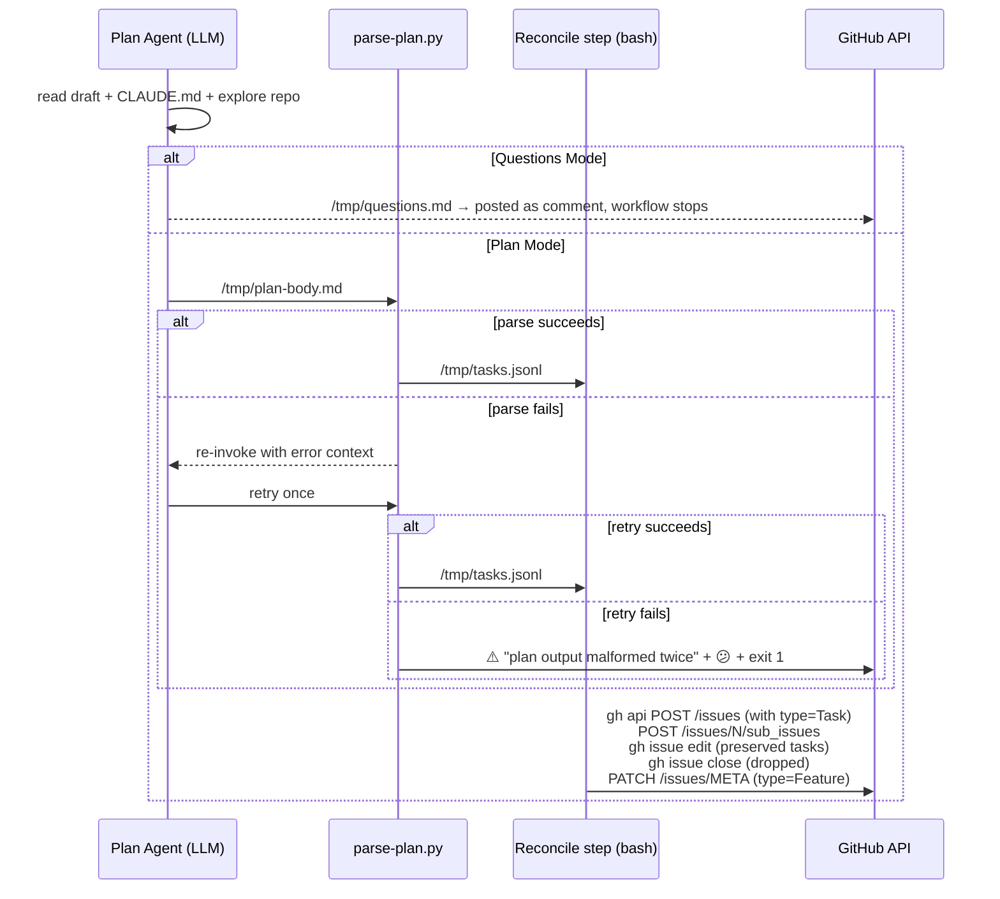

The plan agent NEVER calls `gh` — it just writes `/tmp/plan-body.md`. The parse + reconcile are 100% deterministic bash/Python. If the agent produces malformed output, you get a visible error comment and a failure reaction, not a silent miss.

### Feature issue format

The orchestrator reads a YAML block from the feature issue body. Preferred format:

````markdown
## Plan

```yaml
waves:
  - name: Foundation
    tasks: [1]
  - name: Contracts
    tasks: [2]
  - name: Core
    tasks: [3, 5, 6, 7]
```

## Progress

- [ ] #1 Project Bootstrap `P0`
- [ ] #2 Data Model `P0`
...
````

Markdown fallback (if no YAML block is found):

```markdown
## Wave 1 — Foundation
- [ ] #1 Project Bootstrap `P0`

## Wave 2: Contracts
- [ ] #2 Data Model `P0`
```

Rules:
- **Wave header:** any non-checkbox line containing "Wave <N>" (case-insensitive), any heading level or even plain text.
- **Task:** `- [ ] #N` or `* [ ] #N`, assigned to the most recent wave.
- **State:** derived from merged PRs, not from the checkbox marks — the orchestrator updates checkboxes after scanning merges.

---

## Reference

### Workflow matrix

| Workflow | Trigger | LLM? | Timeout | Key permissions |
|---|---|---|---|---|
| [claude-plan.yml](.github/workflows/claude-plan.yml) | `/agents plan` on non-task issue | ✅ plan-agent (directive-configurable) | 30min | `contents: read`, `issues: write` |
| [claude-feature.yml](.github/workflows/claude-feature.yml) | `/agents start` + PR merge into `feature/*` + `workflow_dispatch` + issue assigned | ❌ pure bash | 10min | `contents: write`, `pull-requests: write`, `issues: write`, `actions: write` |
| [claude-task.yml](.github/workflows/claude-task.yml) | `/agents work` on non-feature issue + `workflow_dispatch` (from orchestrator) | ✅ task worker | 60min | same as feature |
| [claude-fix.yml](.github/workflows/claude-fix.yml) | `/agents fix` on non-feature issue | ✅ fix agent | 60min | same as feature |
| [claude-agents-revert.yml](.github/workflows/claude-agents-revert.yml) | `/agents revert` on feature issue | ❌ pure bash | 10min | `contents: read`, `issues: write` |
| [claude-agents-close.yml](.github/workflows/claude-agents-close.yml) | `/agents close` on feature issue | ❌ pure bash | 10min | `contents: write`, `issues: write`, `pull-requests: write` |

### Agent prompts

All prompts live in [.github/prompts/](.github/prompts/) as editable Markdown. Edit the file, and the next workflow run picks it up — no YAML changes needed.

| File | Used by | Placeholders |
|---|---|---|
| [plan-agent.md](.github/prompts/plan-agent.md) | `claude-plan.yml` | `{{THINK_PHRASE}}` (substituted from directive) |
| [task-worker.md](.github/prompts/task-worker.md) | `claude-task.yml` | none |
| [fix-agent.md](.github/prompts/fix-agent.md) | `claude-fix.yml` | none |

### Scripts

| File | Purpose |
|---|---|
| [.github/scripts/feature-orchestrate.sh](.github/scripts/feature-orchestrate.sh) | The feature orchestrator — 100% deterministic bash. Parses YAML plan, checks merged PRs, updates checkboxes, dispatches the next wave. |
| [.github/scripts/parse-plan.py](.github/scripts/parse-plan.py) | Deterministic Python parser that replaces the former LLM splitter. Reads `/tmp/plan-body.md`, writes `/tmp/tasks.jsonl` for the reconcile step. Writes a structured error report when the plan-agent output is malformed, used by the retry step. |
| [.github/scripts/parse-directive.sh](.github/scripts/parse-directive.sh) | Shared `/agents <verb> [model] [reasoning]` parser. Emits `$GITHUB_OUTPUT`-style `key=value` lines for downstream steps. Used by every LLM-triggering workflow. |
| [.github/scripts/react.sh](.github/scripts/react.sh) | 1-line reaction helper. Posts 👀/👍/😕 to a comment. Fault-tolerant (silent on 4xx). |
| [scripts/setup.sh](scripts/setup.sh) | One-shot prereq validator: labels, secret, permissions, issue types, GitHub App hint. |
| [scripts/install.sh](scripts/install.sh) | Downloads every workflow/script/prompt/template file into `.github/`. Idempotent — re-run to upgrade. |
| [scripts/smoke-test.sh](scripts/smoke-test.sh) | E2E orchestrator test: 3 tasks, 2 waves, polls for final PR, tests reactions + `/agents close`. |
| [scripts/smoke-test-plan.sh](scripts/smoke-test-plan.sh) | E2E plan-pipeline test: creates draft, runs `/agents plan`, asserts types/sub-issues/reactions, tests `/agents revert`. |

### Directive parsing

The `/agents <verb>` grammar is anchored at comment start (`startsWith` filter — no accidental matches from prose). Directive parsing is handled by `.github/scripts/parse-directive.sh`, which normalizes tokens (lowercase, strips punctuation) and ignores unknown words.

| Token class | Values | Default |
|---|---|---|
| command | `plan` / `start` / `work` / `fix` / `revert` / `close` | — |
| model | `opus` / `sonnet` / `haiku` | per verb (plan = opus, work/fix = sonnet) |
| reasoning | `off`, `low`, `medium` (`med`), `high`, `max` (`ultra`, `ultrathink`) | `high` |

Examples: `/agents plan sonnet low`, `/agents fix opus, ultrathink please` (punctuation tolerated).

### Guardrails & known limitations

| Guardrail | How it works |
|---|---|
| Deterministic orchestrator | Pure bash — no LLM probabilistic behaviour in the loop. |
| 60-minute worker timeout | Prevents runaway costs on a single task. |
| Fail-loud on malformed plan | Parser writes a structured error; plan-agent gets one retry with the error context; if both attempts fail, the user sees a comment + 😕 reaction. |
| Failure notifications | Every LLM workflow posts a comment and a 😕 reaction on failure. |
| Fix agent | `/agents fix` for semi-automated recovery with partial-branch resume. |
| Idempotent orchestrator | Re-running `/agents start` is always safe — state is derived from GitHub. |
| Reactions as quick status | 👀 while running, 👍 on success, 😕 on failure — tells you at a glance without reading comments. |

| Limitation | Workaround |
|---|---|
| `GITHUB_TOKEN`-generated events don't trigger other workflows (neither PR merges nor bot comments). | Loop closure uses `workflow_dispatch` (the one exception), called from post-steps. |
| Git refs have replication lag after branch creation. | Task worker polls up to 20s before `actions/checkout`. |
| Parallel tasks in a wave may touch shared files → merge conflicts. | Post-step tries direct merge, falls back to API merge; unresolvable conflicts emit a failure notification that `/agents fix` can pick up. |
| P1+ tasks need human review before merging (with branch protection). | The orchestrator auto-merges P0 only; others wait for review. |
| Issue types aren't configured at the org. | Workflows still run; the `type` PATCH/POST silently no-ops. Only the native type badge is missing; the `feature` label still distinguishes. |

---

## Design decisions

Non-obvious choices, documented for future maintainers:

- **Why is the feature orchestrator pure bash?** It's dispatching and state-tracking, not creative work. Earlier LLM versions were probabilistic about parsing wave structure and updating checkboxes. The bash script is faster (seconds vs minutes), cheaper ($0), and never drifts.

- **Why was the plan-splitter LLM replaced with a Python parser?** Splitting a structured plan body into JSONL is pure parsing — zero creative inference. The old splitter burned ~8 minutes per run at Sonnet pricing; `parse-plan.py` does it in <1s. The retry-on-failure path keeps the "no silent miss" guarantee by re-invoking the plan-agent with specific error context if the parser rejects the output.

- **Why YAML for the plan structure?** Trivially parseable with `yq` (pre-installed on runners), human-editable, and naturally expresses waves.

- **Why `workflow_dispatch` for loop closure?** GitHub deliberately blocks `GITHUB_TOKEN`-generated events from triggering other workflows. `workflow_dispatch` and `repository_dispatch` are the only exceptions. Bot comments by `GITHUB_TOKEN` are silent too, so we can't use comments for cross-workflow communication — but `gh workflow run` works.

- **Why a separate feature branch per plan?** Isolation. Multiple plans can run in parallel without stepping on each other. It's also trivial to abandon a plan — `/agents close` deletes the branch.

- **Why does plan-agent revision use bimodal refs (integer or `Tn`)?** Deterministic reconciliation. The plan-agent decides identity at authoring time by writing a real issue number (preserve) or a fresh placeholder (create) into each `### <ref> — …` heading. Bash reconciles with pure set operations — no LLM-based semantic matching. You can audit every identity choice in the plan body before approving with `/agents start`.

- **Why does the final PR body use `Closes #N` for every task?** GitHub auto-closes referenced issues only when a PR merges into the **default branch**. Task PRs target `feature/*`, not `main`, so `fixes #N` on them doesn't auto-close. The final feature PR carries closure directives for every task plus the feature issue itself.

- **Why `eyes`/`+1`/`confused` instead of hourglass + checkmark?** The GitHub reactions API accepts only a fixed set (`+1, -1, laugh, confused, heart, hooray, rocket, eyes`). `eyes` is the idiomatic "seen / working on it" across GitHub bots; `+1` is the closest "done" signal. There's no hourglass.

- **Why is the directive parser a separate script instead of inlined in each workflow?** Four workflows needed the same model+reasoning parsing. One shared script means one place to add a new model or reasoning level, not four.

- **Why do `/agents revert` and `/agents close` delete comments / branches in bulk instead of interactively?** Determinism. The trigger comment is the consent — if you didn't want destruction, you wouldn't type `/agents close`. Best-effort per-item failures (already-closed issue, missing branch) log warnings but don't abort the rest of the cleanup.

---

## Contributing

Issues and PRs welcome. If you find a new failure mode, please document the root cause in "Known limitations". If you're adding a new `/agents <verb>`, update the commands cheatsheet, the workflow matrix, and at least one Use case diagram.

## License

MIT
